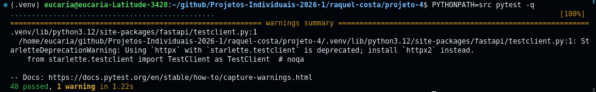
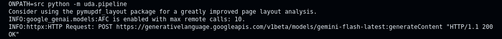
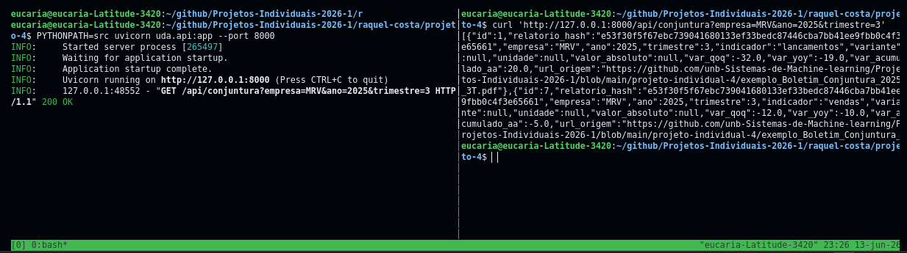
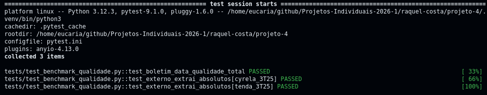
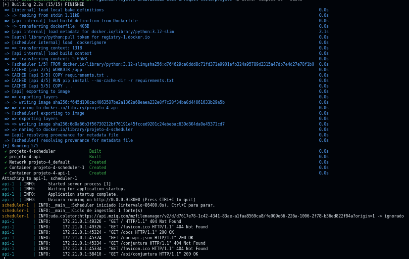

# Projeto Individual 4 — Pipeline de Conjuntura do Setor Habitacional (UDA)


Pipeline de Engenharia/Análise de Dados Não Estruturados (UDA) que extrai, via
LLM (Gemini 2.5 Flash), métricas operacionais (lançamentos e vendas) de Prévias
Operacionais em PDF de Relações com Investidores de construtoras, com três
camadas: extração com idempotência por hash, contrato semântico (Pydantic) e
API REST de consulta. Inclui pré-filtro table-aware, fallback Gemini Vision para
PDFs escaneados, validação semântica pós-LLM, coletor + scheduler de ingestão,
benchmark de qualidade da leitura, Docker e CI.

> Status: MVP + pós-MVP concluídos (fase::0 → fase::6 e evoluções), conforme
> [`docs/planning/backlog.md`](docs/planning/backlog.md).

## Documentação

- [`documento-engenharia.md`](documento-engenharia.md) — documento de engenharia.
- [`docs/CONTEXT.md`](docs/CONTEXT.md) — glossário do domínio.
- [`docs/adr/`](docs/adr/) — decisões de arquitetura (ADRs 0001–0007).
- [`docs/planning/PRD.md`](docs/planning/PRD.md) — PRD do MVP.
- [`docs/planning/backlog.md`](docs/planning/backlog.md) — backlog com triagem.
- [`docs/planning/benchmark-qualidade.md`](docs/planning/benchmark-qualidade.md) — benchmark de qualidade.
- [`docs/planning/ingestao-polling.md`](docs/planning/ingestao-polling.md) — estratégia de ingestão.
- [`docs/diagrams/architecture.md`](docs/diagrams/architecture.md) — diagrama (mermaid).

## Estrutura

```
README.md  documento-engenharia.md  Dockerfile  docker-compose.yml
config/sources.yaml      # fontes do coletor/scheduler
docs/                    # CONTEXT, adr/, planning/, diagrams/
src/uda/                 # config, prefilter, extraction, schemas, db, pipeline,
                         # api, validation, coletor, scheduler, benchmark, hashing
tests/                   # 48 testes (offline)
benchmark/golden/        # verdade-base (esperado) por PDF
benchmark/snapshots/     # extrações gravadas (asserts offline)
data/                    # PDF de exemplo (Boletim 3T25)
```

## Tecnologias utilizadas

| Componente | Tecnologia |
|---|---|
| Linguagem | Python 3.12 |
| Parsing de PDF | PyMuPDF (`fitz`) — texto, `find_tables()`, renderização (Vision) |
| LLM | Google Gemini 2.5 Flash via `google-genai` (saída estruturada `response_schema` + Vision) |
| Contrato semântico | Pydantic |
| Banco / Catálogo | SQLite (`sqlite3`) |
| API | FastAPI + Uvicorn |
| Ingestão | `urllib`, `pyyaml` (config de fontes), `hashlib` (SHA-256) |
| Testes | pytest + httpx |
| Config | python-dotenv (`.env`) |
| Conteinerização | Docker + Docker Compose |
| CI | GitHub Actions |

## Como rodar (do zero)

> Pré-requisitos: Python 3.12+ e `git`. Comandos a partir de `raquel-costa/projeto-4/`.

**1. Ambiente virtual e dependências**
```sh
cd raquel-costa/projeto-4
python -m venv .venv
source .venv/bin/activate          # Windows: .venv\Scripts\activate
pip install -r requirements.txt
```

**2. Chave da API (Gemini)**
```sh
cp .env.example .env
# edite .env -> GEMINI_API_KEY=...   (https://aistudio.google.com/apikey)
```
> A chave é necessária **só** para o que chama o LLM (pipeline, coletor, benchmark).
> Os **testes não precisam de chave**.

**3. Testes (offline — não chamam a API)**
```sh
PYTHONPATH=src pytest -q           # 48 passed
```

**4. Processar o PDF de exemplo (popula o Catálogo SQLite)** — chama o Gemini
```sh
PYTHONPATH=src python -m uda.pipeline
# -> data/exemplo_Boletim_Conjuntura_2025_3T.pdf: processado
# rodar de novo no mesmo PDF -> ignorado  (idempotência)
```

**5. API REST** (em outro terminal, com a venv ativa)
```sh
PYTHONPATH=src uvicorn uda.api:app --reload
# a API retorna [] até o passo 4 popular o banco
curl 'http://127.0.0.1:8000/api/conjuntura?empresa=MRV&ano=2025&trimestre=3'
curl 'http://127.0.0.1:8000/api/conjuntura'            # todos
# Swagger (docs interativa): http://127.0.0.1:8000/docs
```

**6. Coletor de ingestão** (baixa PDFs de fontes e processa, idempotente) — chama o Gemini
```sh
PYTHONPATH=src python -m uda.coletor "<url_de_um_pdf>" ["<outra_url>" ...]
```

**7. Scheduler** (observação contínua — roda o coletor em intervalo sobre `config/sources.yaml`)
```sh
SCHEDULER_INTERVALO_SEG=86400 PYTHONPATH=src python -m uda.scheduler
```

**8. Benchmark de qualidade da leitura** — chama o Gemini
```sh
PYTHONPATH=src python -m uda.benchmark
# imprime a tabela de qualidade (cobertura, precisão, disciplina de NULL, ...)
```

### Alternativa: Docker
```sh
cp .env.example .env               # preencher GEMINI_API_KEY
docker compose up --build          # sobe API (porta 8000) + scheduler
# curl 'http://127.0.0.1:8000/api/conjuntura'
```

> **Cota do Gemini (free tier):** o plano gratuito tem limite diário de
> requisições por modelo. Em uso intenso aparece `429 RESOURCE_EXHAUSTED`;
> aguarde o reset (diário) ou troque de modelo via `GEMINI_MODEL` (ex:
> `gemini-flash-latest`). Os passos que **não** chamam o LLM (testes, API sobre
> banco já populado) seguem funcionando.

## API — endpoints

`GET /api/conjuntura` — lista os indicadores do Catálogo, com filtros opcionais
(combináveis). Cada item inclui `url_origem` (**Linhagem**).

| Parâmetro | Tipo | Exemplo |
|---|---|---|
| `empresa` | str | `MRV` |
| `ano` | int | `2025` |
| `trimestre` | int (1–4) | `3` |
| `variante` | str | `ex_permuta` |
| `unidade` | str | `R$_milhoes` |

```
GET /api/conjuntura                                   # todos os indicadores
GET /api/conjuntura?empresa=MRV&ano=2025&trimestre=3  # filtrado
GET /docs                                             # Swagger UI (interativo)
GET /openapi.json                                     # schema OpenAPI
```

> A raiz `/` não tem rota e retorna `404 {"detail":"Not Found"}` **por design** —
> use `/api/conjuntura` ou `/docs`. No navegador, prefira `http://127.0.0.1:8000/docs`.

## CI

O workflow [`.github/workflows/projeto-4-ci.yml`](../../.github/workflows/projeto-4-ci.yml)
roda a suíte a cada push/PR que toca `raquel-costa/projeto-4/**`. Os testes são
**offline** (sem `GEMINI_API_KEY`): a extração via LLM não é exercitada nos
testes e o benchmark é checado contra snapshots gravados.

## Evidências

Execução local do pipeline ponta-a-ponta (ver [Como rodar](#como-rodar-do-zero)):

**Testes — 48 passando (offline, sem chave)**


**Pipeline — extração do PDF de exemplo**


**API REST — consulta filtrada com Linhagem (`url_origem`)**


**Qualidade da leitura por PDF — 3 layouts (boletim, Cyrela, Tenda)**


**Docker — API + scheduler (ingestão automática + idempotência)**


## Estratégias de melhoria da leitura

Sobre o MVP, estas estratégias elevam a **qualidade e a resiliência** da
extração. Cada uma é detalhada na sua decisão de arquitetura (ADR):

1. **Pré-filtro de páginas + extração table-aware**
   ([ADR-0001](docs/adr/0001-pre-filtro-de-paginas-antes-da-llm.md)): só as
   páginas relevantes (por palavras-chave) são enviadas ao LLM, e suas
   **tabelas vão em Markdown** (`find_tables()`) em vez de texto plano —
   preservando o alinhamento empresa↔valor e reduzindo erros de associação.
2. **Saída estruturada + geração determinística**
   ([ADR-0002](docs/adr/0002-gemini-flash-com-saida-estruturada.md)):
   `response_schema` Pydantic garante JSON válido conforme o contrato;
   `temperature=0.0` e `thinking_budget=0` deixam a extração reprodutível.
3. **Contrato cobre absolutos e percentuais com NULL**
   ([ADR-0005](docs/adr/0005-contrato-cobre-absolutos-e-percentuais-com-null.md)):
   o prompt blinda o banco — campos ausentes viram `NULL`, sem inventar valores.
4. **Campos `variante` e `unidade`**
   ([ADR-0007](docs/adr/0007-variante-e-unidade-no-contrato.md)): desambiguam
   recortes do mesmo indicador (com/ex-permuta) e a unidade de `valor_absoluto`
   (R$ milhões, unidades, empreendimentos), e generalizam o rótulo de empresa.
5. **Validação semântica pós-LLM** (`src/uda/validation.py`): sinaliza linhas
   suspeitas (sem nenhum valor, variação implausível, empresa vazia, ano improvável).
6. **Fallback Gemini Vision**
   ([ADR-0006](docs/adr/0006-fallback-gemini-vision-para-pdfs-sem-texto.md)):
   PDFs sem camada de texto (escaneados) viram imagem + mesmo `response_schema`.
7. **Benchmark de qualidade**
   ([`docs/planning/benchmark-qualidade.md`](docs/planning/benchmark-qualidade.md)):
   mede a leitura contra uma verdade-base — boletim 100% em todas as métricas;
   Cyrela e Tenda com absolutos corretos.

> Decisões completas em [`docs/adr/`](docs/adr/) (ADRs 0001–0007); contexto e
> planejamento em [`docs/planning/`](docs/planning/) e
> [`documento-engenharia.md`](documento-engenharia.md).

## O que está entregue

Mapeado ao enunciado:
- **3 camadas obrigatórias:** Extração (`prefilter`+`extraction`, idempotência
  por hash), Contrato Semântico (`schemas`+prompt+`validation`),
  Catálogo+Linhagem (`db`: cada linha → `url_origem` do PDF).
- **A. Ingestão orientada a eventos:** coletor (`coletor.py`) + scheduler
  (`scheduler.py`, observação contínua via `config/sources.yaml`) + idempotência.
- **B. Processamento:** chunking justificado (ADR-0001); PyMuPDF + Gemini;
  Contrato Pydantic.
- **C. API:** `GET /api/conjuntura?empresa=&ano=&trimestre=` (+ `variante`/`unidade`).
- **Critérios de avaliação:** contrato blindado (disc. NULL 100%), **3 layouts**
  (boletim, Cyrela, Tenda), valores absolutos, modelagem temporal + API.
- **Extras:** Gemini Vision, validação semântica, benchmark + snapshots, Docker, CI.

## Limitações conhecidas

- **Descoberta em portais de RI com JavaScript:** o coletor descobre links `.pdf`
  em HTML estático; portais que carregam a lista via JS (ou links sem extensão,
  ex: `filemanager`) exigem um adaptador por portal — documentado em
  [`docs/planning/ingestao-polling.md`](docs/planning/ingestao-polling.md).
- **Cota do Gemini (free tier):** limite diário → `429` em uso intenso.
- **Coluna `9m 24/23`** do boletim não é modelada (3 campos de variação).
- A API é de leitura, sem autenticação/paginação (não exigidas pelo enunciado).

## Skills (mattpocock)

As skills curadas estão em `.agents/skills/` (não versionado) e linkadas em
`.claude/skills/`. Para restaurar:

```sh
npx skills@latest add mattpocock/skills
mkdir -p .claude/skills && for d in .agents/skills/*/; do n=$(basename "$d"); ln -sf "../../.agents/skills/$n" ".claude/skills/$n"; done
```
