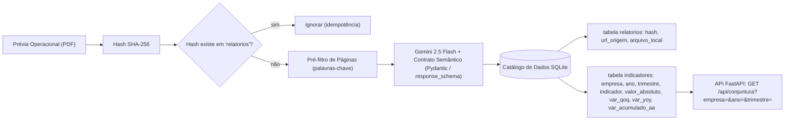

# Arquitetura — Pipeline de Conjuntura do Setor Habitacional

## Notas

- O **Pré-filtro de Páginas** (ADR-0001) reduz o texto enviado ao Gemini,
  selecionando páginas candidatas por palavras-chave (`lançamentos`, `vendas`,
  `VGV`, `unidades`).
- O **Contrato Semântico** (ADR-0002, ADR-0005) força o Gemini a retornar dados
  no formato Pydantic, com `None`/NULL para campos ausentes.
- A **Linhagem** é preservada via `relatorio_hash` na tabela `indicadores`,
  apontando para `url_origem` em `relatorios` (ADR-0003, ADR-0004).
- O **Gatilho de Ingestão** (polling/cron sobre as Centrais de Resultados) não
  está representado neste diagrama — é um próximo passo documentado em
  `docs/planning/00-overview.md`, fora do MVP.
